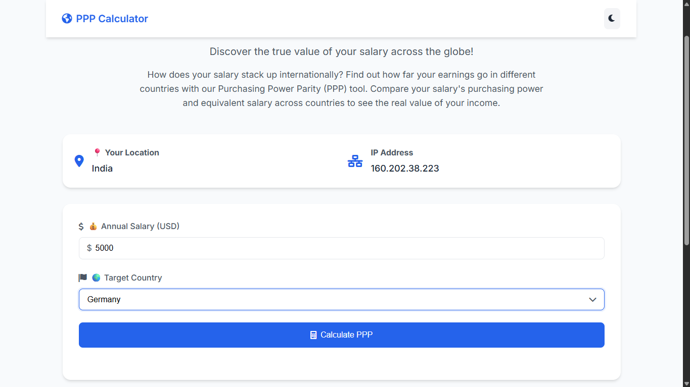
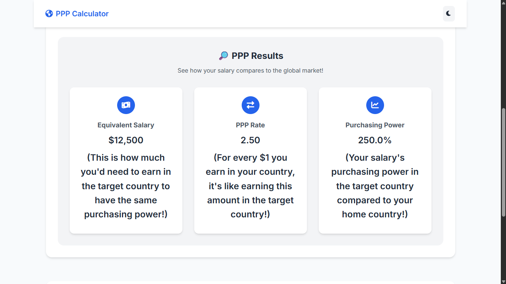

# 🌍 Global Purchasing Power Parity (PPP) Calculator

A modern web application that helps users understand and compare their salary's purchasing power across different countries using Purchasing Power Parity (PPP) calculations.




## ✨ Features

- 🌐 Real-time country and IP detection
- 💰 PPP-based salary conversion
- 🌓 Light/Dark theme support
- 📱 Responsive design for all devices
- 🎨 Modern and intuitive UI
- 📊 Detailed PPP calculations and comparisons
- 🔄 Real-time updates and animations
- 🔒 Privacy-focused (no data storage)

## 🚀 Live Demo

[Try the PPP Calculator](https://ppp-calculator1.netlify.app/)

## 🛠️ Technologies Used

- HTML5
- CSS3 (with CSS Variables for theming)
- JavaScript (ES6+)
- Font Awesome Icons
- Google Fonts (Inter)
- External APIs:
  - ipify.org (IP detection)
  - ipapi.co (Country detection)

## 📋 Prerequisites

- Modern web browser (Chrome, Firefox, Safari, Edge)
- Internet connection (for API calls)

## 🏗️ Installation

1. Clone the repository:
```bash
git clone https://github.com/Anand-Ambastha/ppp-calculator.git
```

2. Navigate to the project directory:
```bash
cd ppp-calculator
```

3. Open `index.html` in your browser or use a local server:
```bash
# Using Python
python -m http.server 8000

# Using Node.js
npx serve
```

## 💻 Usage

1. Enter your annual salary in USD
2. Select a target country from the dropdown
3. Click "Calculate PPP" to see the results
4. View your equivalent salary, PPP rate, and purchasing power comparison

## 🎨 Theme Colors

### Light Theme
- Primary: #2563eb
- Background: #f8fafc
- Text: #1f2937
- Card Background: #ffffff

### Dark Theme
- Primary: #3b82f6
- Background: #0f172a
- Text: #f1f5f9
- Card Background: #1e293b

## 📊 PPP Data Sources

The application uses PPP conversion rates from:
- World Bank
- International Monetary Fund (IMF)
- OECD

## 🔒 Privacy

- No user data is stored
- IP detection is used only for country identification
- All calculations are performed client-side

## 🤝 Contributing

Contributions are welcome! Please feel free to submit a Pull Request.

1. Fork the repository
2. Create your feature branch (`git checkout -b feature/AmazingFeature`)
3. Commit your changes (`git commit -m 'Add some AmazingFeature'`)
4. Push to the branch (`git push origin feature/AmazingFeature`)
5. Open a Pull Request

## 📝 License

This project is licensed under the MIT License - see the [LICENSE](LICENSE) file for details.

## 👥 Authors

- Your Name - Initial work - [Anand Ambastha](https://github.com/Anand-Ambastha)

## 🙏 Acknowledgments

- [ipify.org](https://www.ipify.org/) for IP detection
- [ipapi.co](https://ipapi.co/) for country detection
- [Font Awesome](https://fontawesome.com/) for icons
- [Google Fonts](https://fonts.google.com/) for the Inter font family

## 📞 Support

If you have any questions or need help, please:
- Open an issue
- Contact us at your-anandambastha72@gmail.com

## 🔄 Updates

### Version 1.0.0
- Initial release
- Basic PPP calculation functionality
- Country and IP detection
- Responsive design
- Dark mode support

### Version 1.1.0
- Added real-time PPP data
- Improved UI/UX
- Enhanced error handling
- Added loading states
- Improved accessibility

## 📚 Resources

- [What is PPP?](https://www.investopedia.com/terms/p/purchasingpower.asp)
- [World Bank PPP Data](https://data.worldbank.org/indicator/PA.NUS.PPP)
- [IMF PPP Data](https://www.imf.org/en/Publications/WEO/weo-database/2023/April/weo-report)

---

⭐ Star this repository if you find it useful! 
